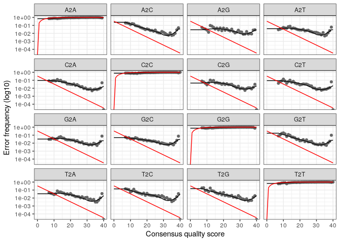

CC3Marion
================
Marion Drouan
2023-01-02

``` bash
mkdir data
wget -P data -i URL
```

``` r
path <- "data"
list.files(path)
```

    ##   [1] "filtered"              "SRR7587113_1.fastq.gz" "SRR7587113_2.fastq.gz"
    ##   [4] "SRR7587114_1.fastq.gz" "SRR7587114_2.fastq.gz" "SRR7587115_1.fastq.gz"
    ##   [7] "SRR7587115_2.fastq.gz" "SRR7587116_1.fastq.gz" "SRR7587116_2.fastq.gz"
    ##  [10] "SRR7587117_1.fastq.gz" "SRR7587117_2.fastq.gz" "SRR7587118_1.fastq.gz"
    ##  [13] "SRR7587118_2.fastq.gz" "SRR7587119_1.fastq.gz" "SRR7587119_2.fastq.gz"
    ##  [16] "SRR7587120_1.fastq.gz" "SRR7587120_2.fastq.gz" "SRR7587121_1.fastq.gz"
    ##  [19] "SRR7587121_2.fastq.gz" "SRR7587122_1.fastq.gz" "SRR7587122_2.fastq.gz"
    ##  [22] "SRR7587123_1.fastq.gz" "SRR7587123_2.fastq.gz" "SRR7587124_1.fastq.gz"
    ##  [25] "SRR7587124_2.fastq.gz" "SRR7587125_1.fastq.gz" "SRR7587125_2.fastq.gz"
    ##  [28] "SRR7587126_1.fastq.gz" "SRR7587126_2.fastq.gz" "SRR7587127_1.fastq.gz"
    ##  [31] "SRR7587127_2.fastq.gz" "SRR7587128_1.fastq.gz" "SRR7587128_2.fastq.gz"
    ##  [34] "SRR7587129_1.fastq.gz" "SRR7587129_2.fastq.gz" "SRR7587130_1.fastq.gz"
    ##  [37] "SRR7587130_2.fastq.gz" "SRR7587131_1.fastq.gz" "SRR7587131_2.fastq.gz"
    ##  [40] "SRR7587132_1.fastq.gz" "SRR7587132_2.fastq.gz" "SRR7587133_1.fastq.gz"
    ##  [43] "SRR7587133_2.fastq.gz" "SRR7587134_1.fastq.gz" "SRR7587134_2.fastq.gz"
    ##  [46] "SRR7587135_1.fastq.gz" "SRR7587135_2.fastq.gz" "SRR7587136_1.fastq.gz"
    ##  [49] "SRR7587136_2.fastq.gz" "SRR7587137_1.fastq.gz" "SRR7587137_2.fastq.gz"
    ##  [52] "SRR7587138_1.fastq.gz" "SRR7587138_2.fastq.gz" "SRR7587139_1.fastq.gz"
    ##  [55] "SRR7587139_2.fastq.gz" "SRR7587140_1.fastq.gz" "SRR7587140_2.fastq.gz"
    ##  [58] "SRR7587141_1.fastq.gz" "SRR7587141_2.fastq.gz" "SRR7587142_1.fastq.gz"
    ##  [61] "SRR7587142_2.fastq.gz" "SRR7587143_1.fastq.gz" "SRR7587143_2.fastq.gz"
    ##  [64] "SRR7587144_1.fastq.gz" "SRR7587144_2.fastq.gz" "SRR7587145_1.fastq.gz"
    ##  [67] "SRR7587145_2.fastq.gz" "SRR7587146_1.fastq.gz" "SRR7587146_2.fastq.gz"
    ##  [70] "SRR7587147_1.fastq.gz" "SRR7587147_2.fastq.gz" "SRR7587148_1.fastq.gz"
    ##  [73] "SRR7587148_2.fastq.gz" "SRR7587149_1.fastq.gz" "SRR7587149_2.fastq.gz"
    ##  [76] "SRR7587150_1.fastq.gz" "SRR7587150_2.fastq.gz" "SRR7587151_1.fastq.gz"
    ##  [79] "SRR7587151_2.fastq.gz" "SRR7587152_1.fastq.gz" "SRR7587152_2.fastq.gz"
    ##  [82] "SRR7587153_1.fastq.gz" "SRR7587153_2.fastq.gz" "SRR7587154_1.fastq.gz"
    ##  [85] "SRR7587154_2.fastq.gz" "SRR7587155_1.fastq.gz" "SRR7587155_2.fastq.gz"
    ##  [88] "SRR7587156_1.fastq.gz" "SRR7587156_2.fastq.gz" "SRR7587157_1.fastq.gz"
    ##  [91] "SRR7587157_2.fastq.gz" "SRR7587158_1.fastq.gz" "SRR7587158_2.fastq.gz"
    ##  [94] "SRR7587159_1.fastq.gz" "SRR7587159_2.fastq.gz" "SRR7587160_1.fastq.gz"
    ##  [97] "SRR7587160_2.fastq.gz" "SRR7587161_1.fastq.gz" "SRR7587161_2.fastq.gz"
    ## [100] "SRR7587162_1.fastq.gz" "SRR7587162_2.fastq.gz" "SRR7587163_1.fastq.gz"
    ## [103] "SRR7587163_2.fastq.gz" "SRR7587164_1.fastq.gz" "SRR7587164_2.fastq.gz"
    ## [106] "SRR7587165_1.fastq.gz" "SRR7587165_2.fastq.gz" "SRR7587166_1.fastq.gz"
    ## [109] "SRR7587166_2.fastq.gz" "SRR7587167_1.fastq.gz" "SRR7587167_2.fastq.gz"
    ## [112] "SRR7587168_1.fastq.gz" "SRR7587168_2.fastq.gz" "SRR7587169_1.fastq.gz"
    ## [115] "SRR7587169_2.fastq.gz" "SRR7587170_1.fastq.gz" "SRR7587170_2.fastq.gz"
    ## [118] "SRR7587171_1.fastq.gz" "SRR7587171_2.fastq.gz" "SRR7587172_1.fastq.gz"
    ## [121] "SRR7587172_2.fastq.gz" "SRR7587173_1.fastq.gz" "SRR7587173_2.fastq.gz"
    ## [124] "SRR7587174_1.fastq.gz" "SRR7587174_2.fastq.gz" "SRR7587175_1.fastq.gz"
    ## [127] "SRR7587175_2.fastq.gz" "SRR7587176_1.fastq.gz" "SRR7587176_2.fastq.gz"
    ## [130] "SRR7587177_1.fastq.gz" "SRR7587177_2.fastq.gz" "SRR7587178_1.fastq.gz"
    ## [133] "SRR7587178_2.fastq.gz" "SRR7587179_1.fastq.gz" "SRR7587179_2.fastq.gz"
    ## [136] "SRR7587180_1.fastq.gz" "SRR7587180_2.fastq.gz" "SRR7587181_1.fastq.gz"
    ## [139] "SRR7587181_2.fastq.gz" "SRR7587182_1.fastq.gz" "SRR7587182_2.fastq.gz"
    ## [142] "SRR7587183_1.fastq.gz" "SRR7587183_2.fastq.gz" "SRR7587184_1.fastq.gz"
    ## [145] "SRR7587184_2.fastq.gz" "SRR7587185_1.fastq.gz" "SRR7587185_2.fastq.gz"
    ## [148] "SRR7587186_1.fastq.gz" "SRR7587186_2.fastq.gz" "SRR7587187_1.fastq.gz"
    ## [151] "SRR7587187_2.fastq.gz" "SRR7587188_1.fastq.gz" "SRR7587188_2.fastq.gz"
    ## [154] "SRR7587189_1.fastq.gz" "SRR7587189_2.fastq.gz" "SRR7587190_1.fastq.gz"
    ## [157] "SRR7587190_2.fastq.gz" "SRR7587191_1.fastq.gz" "SRR7587191_2.fastq.gz"
    ## [160] "SRR7587192_1.fastq.gz" "SRR7587192_2.fastq.gz" "SRR7587193_1.fastq.gz"
    ## [163] "SRR7587193_2.fastq.gz" "SRR7587194_1.fastq.gz" "SRR7587194_2.fastq.gz"
    ## [166] "SRR7587195_1.fastq.gz" "SRR7587195_2.fastq.gz" "SRR7587196_1.fastq.gz"
    ## [169] "SRR7587196_2.fastq.gz" "SRR7587197_1.fastq.gz" "SRR7587197_2.fastq.gz"
    ## [172] "SRR7587198_1.fastq.gz" "SRR7587198_2.fastq.gz" "SRR7587199_1.fastq.gz"
    ## [175] "SRR7587199_2.fastq.gz" "SRR7587200_1.fastq.gz" "SRR7587200_2.fastq.gz"
    ## [178] "SRR7587201_1.fastq.gz" "SRR7587201_2.fastq.gz" "SRR7587202_1.fastq.gz"
    ## [181] "SRR7587202_2.fastq.gz" "SRR7587203_1.fastq.gz" "SRR7587203_2.fastq.gz"
    ## [184] "SRR7587204_1.fastq.gz" "SRR7587204_2.fastq.gz" "SRR7587205_1.fastq.gz"
    ## [187] "SRR7587205_2.fastq.gz" "SRR7587206_1.fastq.gz" "SRR7587206_2.fastq.gz"
    ## [190] "SRR7587207_1.fastq.gz" "SRR7587207_2.fastq.gz" "SRR7587208_1.fastq.gz"
    ## [193] "SRR7587208_2.fastq.gz" "SRR7587209_1.fastq.gz" "SRR7587209_2.fastq.gz"
    ## [196] "SRR7587210_1.fastq.gz" "SRR7587210_2.fastq.gz" "SRR7587211_1.fastq.gz"
    ## [199] "SRR7587211_2.fastq.gz" "SRR7587212_1.fastq.gz" "SRR7587212_2.fastq.gz"
    ## [202] "SRR7587213_1.fastq.gz" "SRR7587213_2.fastq.gz" "SRR7587214_1.fastq.gz"
    ## [205] "SRR7587214_2.fastq.gz" "SRR7587215_1.fastq.gz" "SRR7587215_2.fastq.gz"
    ## [208] "SRR7587216_1.fastq.gz" "SRR7587216_2.fastq.gz" "SRR7587217_1.fastq.gz"
    ## [211] "SRR7587217_2.fastq.gz" "SRR7587218_1.fastq.gz" "SRR7587218_2.fastq.gz"
    ## [214] "SRR7587219_1.fastq.gz" "SRR7587219_2.fastq.gz" "SRR7587220_1.fastq.gz"
    ## [217] "SRR7587220_2.fastq.gz" "SRR7587221_1.fastq.gz" "SRR7587221_2.fastq.gz"
    ## [220] "SRR7587222_1.fastq.gz" "SRR7587222_2.fastq.gz" "SRR7587223_1.fastq.gz"
    ## [223] "SRR7587223_2.fastq.gz" "SRR7587224_1.fastq.gz" "SRR7587224_2.fastq.gz"
    ## [226] "SRR7587225_1.fastq.gz" "SRR7587225_2.fastq.gz" "SRR7587226_1.fastq.gz"
    ## [229] "SRR7587226_2.fastq.gz" "SRR7587227_1.fastq.gz" "SRR7587227_2.fastq.gz"
    ## [232] "SRR7587228_1.fastq.gz" "SRR7587228_2.fastq.gz" "SRR7587229_1.fastq.gz"
    ## [235] "SRR7587229_2.fastq.gz" "SRR7587230_1.fastq.gz" "SRR7587230_2.fastq.gz"
    ## [238] "SRR7587231_1.fastq.gz" "SRR7587231_2.fastq.gz" "SRR7587232_1.fastq.gz"
    ## [241] "SRR7587232_2.fastq.gz" "SRR7587233_1.fastq.gz" "SRR7587233_2.fastq.gz"
    ## [244] "SRR7587234_1.fastq.gz" "SRR7587234_2.fastq.gz" "SRR7587235_1.fastq.gz"
    ## [247] "SRR7587235_2.fastq.gz" "SRR7587236_1.fastq.gz" "SRR7587236_2.fastq.gz"
    ## [250] "SRR7587237_1.fastq.gz" "SRR7587237_2.fastq.gz" "SRR7587238_1.fastq.gz"
    ## [253] "SRR7587238_2.fastq.gz" "SRR7587239_1.fastq.gz" "SRR7587239_2.fastq.gz"
    ## [256] "SRR7587240_1.fastq.gz" "SRR7587240_2.fastq.gz" "SRR7587241_1.fastq.gz"
    ## [259] "SRR7587241_2.fastq.gz" "SRR7587242.fastq.gz"   "SRR7587243_1.fastq.gz"
    ## [262] "SRR7587243_2.fastq.gz" "SRR7587244_1.fastq.gz" "SRR7587244_2.fastq.gz"
    ## [265] "SRR7587245_1.fastq.gz" "SRR7587245_2.fastq.gz" "SRR7587246_1.fastq.gz"
    ## [268] "SRR7587246_2.fastq.gz" "SRR7587247_1.fastq.gz" "SRR7587247_2.fastq.gz"
    ## [271] "SRR7587248_1.fastq.gz" "SRR7587248_2.fastq.gz" "SRR7587249_1.fastq.gz"
    ## [274] "SRR7587249_2.fastq.gz" "SRR7587250_1.fastq.gz" "SRR7587250_2.fastq.gz"
    ## [277] "SRR7587251_1.fastq.gz" "SRR7587251_2.fastq.gz" "SRR7587252_1.fastq.gz"
    ## [280] "SRR7587252_2.fastq.gz" "SRR7587253_1.fastq.gz" "SRR7587253_2.fastq.gz"
    ## [283] "SRR7587254_1.fastq.gz" "SRR7587254_2.fastq.gz" "SRR7587255_1.fastq.gz"
    ## [286] "SRR7587255_2.fastq.gz" "SRR7587256_1.fastq.gz" "SRR7587256_2.fastq.gz"
    ## [289] "SRR7587257_1.fastq.gz" "SRR7587257_2.fastq.gz" "SRR7587258.fastq.gz"  
    ## [292] "SRR7587259_1.fastq.gz" "SRR7587259_2.fastq.gz" "SRR7587260.fastq.gz"  
    ## [295] "SRR7587261.fastq.gz"   "SRR7587262_1.fastq.gz" "SRR7587262_2.fastq.gz"
    ## [298] "SRR7587263_1.fastq.gz" "SRR7587263_2.fastq.gz" "SRR7587264_1.fastq.gz"
    ## [301] "SRR7587264_2.fastq.gz" "SRR7587265_1.fastq.gz" "SRR7587265_2.fastq.gz"
    ## [304] "SRR7587266_1.fastq.gz" "SRR7587266_2.fastq.gz" "SRR7587267.fastq.gz"  
    ## [307] "SRR7587268.fastq.gz"   "SRR7587269_1.fastq.gz" "SRR7587269_2.fastq.gz"
    ## [310] "SRR7587270_1.fastq.gz" "SRR7587270_2.fastq.gz" "SRR7587271_1.fastq.gz"
    ## [313] "SRR7587271_2.fastq.gz" "SRR7587272_1.fastq.gz" "SRR7587272_2.fastq.gz"
    ## [316] "SRR7587273_1.fastq.gz" "SRR7587273_2.fastq.gz" "SRR7587274_1.fastq.gz"
    ## [319] "SRR7587274_2.fastq.gz" "SRR7587275_1.fastq.gz" "SRR7587275_2.fastq.gz"
    ## [322] "SRR7587276_1.fastq.gz" "SRR7587276_2.fastq.gz" "SRR7587277_1.fastq.gz"
    ## [325] "SRR7587277_2.fastq.gz" "SRR7587278_1.fastq.gz" "SRR7587278_2.fastq.gz"
    ## [328] "SRR7587279_1.fastq.gz" "SRR7587279_2.fastq.gz" "SRR7587280_1.fastq.gz"
    ## [331] "SRR7587280_2.fastq.gz" "SRR7587281_1.fastq.gz" "SRR7587281_2.fastq.gz"
    ## [334] "SRR7587282_1.fastq.gz" "SRR7587282_2.fastq.gz" "SRR7587283_1.fastq.gz"
    ## [337] "SRR7587283_2.fastq.gz" "SRR7587284_1.fastq.gz" "SRR7587284_2.fastq.gz"
    ## [340] "SRR7587285_1.fastq.gz" "SRR7587285_2.fastq.gz" "SRR7587286_1.fastq.gz"
    ## [343] "SRR7587286_2.fastq.gz" "SRR7587287_1.fastq.gz" "SRR7587287_2.fastq.gz"
    ## [346] "SRR7587288_1.fastq.gz" "SRR7587288_2.fastq.gz" "SRR7587289_1.fastq.gz"
    ## [349] "SRR7587289_2.fastq.gz" "SRR7587290_1.fastq.gz" "SRR7587290_2.fastq.gz"
    ## [352] "SRR7587291_1.fastq.gz" "SRR7587291_2.fastq.gz" "SRR7587292_1.fastq.gz"
    ## [355] "SRR7587292_2.fastq.gz" "SRR7587293_1.fastq.gz" "SRR7587293_2.fastq.gz"
    ## [358] "SRR7587294_1.fastq.gz" "SRR7587294_2.fastq.gz" "SRR7587295_1.fastq.gz"
    ## [361] "SRR7587295_2.fastq.gz" "SRR7587296_1.fastq.gz" "SRR7587296_2.fastq.gz"
    ## [364] "SRR7587297_1.fastq.gz" "SRR7587297_2.fastq.gz" "SRR7587298_1.fastq.gz"
    ## [367] "SRR7587298_2.fastq.gz" "SRR7587299_1.fastq.gz" "SRR7587299_2.fastq.gz"
    ## [370] "SRR7587300_1.fastq.gz" "SRR7587300_2.fastq.gz" "SRR7587301_1.fastq.gz"
    ## [373] "SRR7587301_2.fastq.gz" "SRR7587302_1.fastq.gz" "SRR7587302_2.fastq.gz"
    ## [376] "SRR7587303_1.fastq.gz" "SRR7587303_2.fastq.gz" "SRR7587304_1.fastq.gz"
    ## [379] "SRR7587304_2.fastq.gz" "SRR7587305_1.fastq.gz" "SRR7587305_2.fastq.gz"
    ## [382] "SRR7587306_1.fastq.gz" "SRR7587306_2.fastq.gz" "SRR7587307_1.fastq.gz"
    ## [385] "SRR7587307_2.fastq.gz" "SRR7587308_1.fastq.gz" "SRR7587308_2.fastq.gz"
    ## [388] "SRR7587309_1.fastq.gz" "SRR7587309_2.fastq.gz" "SRR7587310_1.fastq.gz"
    ## [391] "SRR7587310_2.fastq.gz" "SRR7587311_1.fastq.gz" "SRR7587311_2.fastq.gz"

``` r
fnR1 <- sort(list.files(path, pattern="_1", full.names = TRUE))
fnR2 <- sort(list.files(path, pattern="_2", full.names = TRUE))
sample.names <- sapply(strsplit(basename(fnR1), "_"), `[`, 1)
```

``` r
plotQualityProfile(fnR1[1:2])
```

    ## Warning: `guides(<scale> = FALSE)` is deprecated. Please use `guides(<scale> =
    ## "none")` instead.

<!-- -->

``` r
plotQualityProfile(fnR2[1:2])
```

    ## Warning: `guides(<scale> = FALSE)` is deprecated. Please use `guides(<scale> =
    ## "none")` instead.

<!-- -->

\#Filter and trim

``` r
filtR1 <- file.path(path, "filtered", paste0(sample.names, "_1_filt.fastq.gz"))
filtR2 <- file.path(path, "filtered", paste0(sample.names, "_2_filt.fastq.gz"))
names(filtR1) <- sample.names
names(filtR2) <- sample.names
```

``` r
out <- filterAndTrim(fnR1, filtR1, fnR2, filtR2, truncLen=c(250,240), trimLeft=c(18,18), maxN=0, maxEE=c(2,2), truncQ=2, rm.phix=TRUE, compress=TRUE, multithread=TRUE)
```

    ## Some input samples had no reads pass the filter.

``` r
head(out)
```

    ##                       reads.in reads.out
    ## SRR7587113_1.fastq.gz    94718         6
    ## SRR7587114_1.fastq.gz    92113         3
    ## SRR7587115_1.fastq.gz   105813         5
    ## SRR7587116_1.fastq.gz    95993       120
    ## SRR7587117_1.fastq.gz   103646         4
    ## SRR7587118_1.fastq.gz    89527         5

``` r
table(file.exists(filtR1))
```

    ## 
    ## FALSE  TRUE 
    ##    28   165

``` r
table(file.exists(filtR2))
```

    ## 
    ## FALSE  TRUE 
    ##    28   165

``` r
exists <- file.exists(filtR1) & file.exists(filtR2)
filtR1 <- filtR1[exists]
filtR2 <- filtR2[exists]
```

\#Learn the Error Rates

``` r
errR1 <- learnErrors(filtR1, multithread=TRUE)
```

    ## 22877520 total bases in 98610 reads from 165 samples will be used for learning the error rates.

``` r
errR2 <- learnErrors(filtR2, multithread=TRUE)
```

    ## 21891420 total bases in 98610 reads from 165 samples will be used for learning the error rates.

``` r
plotErrors(errR1, nominalQ=TRUE)
```

    ## Warning: Transformation introduced infinite values in continuous y-axis
    ## Transformation introduced infinite values in continuous y-axis

<!-- -->

``` r
plotErrors(errR2, nominalQ=TRUE)
```

    ## Warning: Transformation introduced infinite values in continuous y-axis
    ## Transformation introduced infinite values in continuous y-axis

<!-- -->

\#Sample Inference

``` r
dadaR1 <- dada(filtR1, err=errR1, multithread=TRUE)
```

    ## Sample 1 - 6 reads in 6 unique sequences.
    ## Sample 2 - 3 reads in 3 unique sequences.
    ## Sample 3 - 5 reads in 5 unique sequences.
    ## Sample 4 - 120 reads in 103 unique sequences.
    ## Sample 5 - 4 reads in 4 unique sequences.
    ## Sample 6 - 5 reads in 5 unique sequences.
    ## Sample 7 - 6 reads in 6 unique sequences.
    ## Sample 8 - 5 reads in 5 unique sequences.
    ## Sample 9 - 39 reads in 34 unique sequences.
    ## Sample 10 - 130 reads in 91 unique sequences.
    ## Sample 11 - 142 reads in 117 unique sequences.
    ## Sample 12 - 66 reads in 64 unique sequences.
    ## Sample 13 - 635 reads in 359 unique sequences.
    ## Sample 14 - 114 reads in 84 unique sequences.
    ## Sample 15 - 129 reads in 98 unique sequences.
    ## Sample 16 - 70 reads in 55 unique sequences.
    ## Sample 17 - 54 reads in 29 unique sequences.
    ## Sample 18 - 23 reads in 16 unique sequences.
    ## Sample 19 - 4 reads in 4 unique sequences.
    ## Sample 20 - 6932 reads in 1891 unique sequences.
    ## Sample 21 - 57 reads in 30 unique sequences.
    ## Sample 22 - 11 reads in 10 unique sequences.
    ## Sample 23 - 17 reads in 17 unique sequences.
    ## Sample 24 - 16 reads in 16 unique sequences.
    ## Sample 25 - 688 reads in 317 unique sequences.
    ## Sample 26 - 188 reads in 98 unique sequences.
    ## Sample 27 - 156 reads in 84 unique sequences.
    ## Sample 28 - 49 reads in 38 unique sequences.
    ## Sample 29 - 33 reads in 31 unique sequences.
    ## Sample 30 - 28 reads in 27 unique sequences.
    ## Sample 31 - 226 reads in 112 unique sequences.
    ## Sample 32 - 10 reads in 10 unique sequences.
    ## Sample 33 - 20 reads in 20 unique sequences.
    ## Sample 34 - 14 reads in 14 unique sequences.
    ## Sample 35 - 26 reads in 26 unique sequences.
    ## Sample 36 - 32 reads in 29 unique sequences.
    ## Sample 37 - 35 reads in 34 unique sequences.
    ## Sample 38 - 1 reads in 1 unique sequences.
    ## Sample 39 - 2690 reads in 1094 unique sequences.
    ## Sample 40 - 101 reads in 91 unique sequences.
    ## Sample 41 - 19 reads in 19 unique sequences.
    ## Sample 42 - 156 reads in 140 unique sequences.
    ## Sample 43 - 45 reads in 43 unique sequences.
    ## Sample 44 - 231 reads in 198 unique sequences.
    ## Sample 45 - 75 reads in 72 unique sequences.
    ## Sample 46 - 107 reads in 94 unique sequences.
    ## Sample 47 - 169 reads in 140 unique sequences.
    ## Sample 48 - 38 reads in 36 unique sequences.
    ## Sample 49 - 3 reads in 3 unique sequences.
    ## Sample 50 - 13 reads in 12 unique sequences.
    ## Sample 51 - 28 reads in 26 unique sequences.
    ## Sample 52 - 19613 reads in 3504 unique sequences.
    ## Sample 53 - 31 reads in 23 unique sequences.
    ## Sample 54 - 479 reads in 208 unique sequences.
    ## Sample 55 - 349 reads in 223 unique sequences.
    ## Sample 56 - 2652 reads in 1166 unique sequences.
    ## Sample 57 - 9 reads in 9 unique sequences.
    ## Sample 58 - 8 reads in 8 unique sequences.
    ## Sample 59 - 2 reads in 2 unique sequences.
    ## Sample 60 - 17 reads in 17 unique sequences.
    ## Sample 61 - 6 reads in 6 unique sequences.
    ## Sample 62 - 17 reads in 17 unique sequences.
    ## Sample 63 - 8 reads in 8 unique sequences.
    ## Sample 64 - 22 reads in 22 unique sequences.
    ## Sample 65 - 371 reads in 161 unique sequences.
    ## Sample 66 - 431 reads in 248 unique sequences.
    ## Sample 67 - 1143 reads in 484 unique sequences.
    ## Sample 68 - 551 reads in 326 unique sequences.
    ## Sample 69 - 866 reads in 436 unique sequences.
    ## Sample 70 - 705 reads in 344 unique sequences.
    ## Sample 71 - 476 reads in 266 unique sequences.
    ## Sample 72 - 5288 reads in 1562 unique sequences.
    ## Sample 73 - 2899 reads in 1133 unique sequences.
    ## Sample 74 - 19 reads in 16 unique sequences.
    ## Sample 75 - 1 reads in 1 unique sequences.
    ## Sample 76 - 15 reads in 7 unique sequences.
    ## Sample 77 - 3783 reads in 1389 unique sequences.
    ## Sample 78 - 1 reads in 1 unique sequences.
    ## Sample 79 - 5 reads in 5 unique sequences.
    ## Sample 80 - 8 reads in 8 unique sequences.
    ## Sample 81 - 4 reads in 4 unique sequences.
    ## Sample 82 - 18 reads in 17 unique sequences.
    ## Sample 83 - 14 reads in 13 unique sequences.
    ## Sample 84 - 18 reads in 15 unique sequences.
    ## Sample 85 - 732 reads in 373 unique sequences.
    ## Sample 86 - 43 reads in 34 unique sequences.
    ## Sample 87 - 112 reads in 74 unique sequences.
    ## Sample 88 - 20 reads in 17 unique sequences.
    ## Sample 89 - 6 reads in 6 unique sequences.
    ## Sample 90 - 164 reads in 135 unique sequences.
    ## Sample 91 - 912 reads in 547 unique sequences.
    ## Sample 92 - 20 reads in 20 unique sequences.
    ## Sample 93 - 5 reads in 5 unique sequences.
    ## Sample 94 - 283 reads in 179 unique sequences.
    ## Sample 95 - 34 reads in 24 unique sequences.
    ## Sample 96 - 4 reads in 4 unique sequences.
    ## Sample 97 - 22 reads in 13 unique sequences.
    ## Sample 98 - 8 reads in 8 unique sequences.
    ## Sample 99 - 1 reads in 1 unique sequences.
    ## Sample 100 - 6 reads in 6 unique sequences.
    ## Sample 101 - 2 reads in 2 unique sequences.
    ## Sample 102 - 441 reads in 441 unique sequences.
    ## Sample 103 - 2 reads in 2 unique sequences.
    ## Sample 104 - 107 reads in 53 unique sequences.
    ## Sample 105 - 59 reads in 30 unique sequences.
    ## Sample 106 - 24393 reads in 2926 unique sequences.
    ## Sample 107 - 596 reads in 306 unique sequences.
    ## Sample 108 - 42 reads in 28 unique sequences.
    ## Sample 109 - 2 reads in 2 unique sequences.
    ## Sample 110 - 3 reads in 3 unique sequences.
    ## Sample 111 - 3 reads in 3 unique sequences.
    ## Sample 112 - 11 reads in 9 unique sequences.
    ## Sample 113 - 224 reads in 119 unique sequences.
    ## Sample 114 - 59 reads in 47 unique sequences.
    ## Sample 115 - 177 reads in 82 unique sequences.
    ## Sample 116 - 150 reads in 118 unique sequences.
    ## Sample 117 - 271 reads in 134 unique sequences.
    ## Sample 118 - 121 reads in 64 unique sequences.
    ## Sample 119 - 48 reads in 26 unique sequences.
    ## Sample 120 - 5 reads in 5 unique sequences.
    ## Sample 121 - 3 reads in 3 unique sequences.
    ## Sample 122 - 1 reads in 1 unique sequences.
    ## Sample 123 - 6 reads in 6 unique sequences.
    ## Sample 124 - 45 reads in 41 unique sequences.
    ## Sample 125 - 159 reads in 106 unique sequences.
    ## Sample 126 - 7 reads in 7 unique sequences.
    ## Sample 127 - 6 reads in 6 unique sequences.
    ## Sample 128 - 4 reads in 4 unique sequences.
    ## Sample 129 - 432 reads in 420 unique sequences.
    ## Sample 130 - 7 reads in 7 unique sequences.
    ## Sample 131 - 1 reads in 1 unique sequences.
    ## Sample 132 - 4 reads in 4 unique sequences.
    ## Sample 133 - 429 reads in 421 unique sequences.
    ## Sample 134 - 2 reads in 2 unique sequences.
    ## Sample 135 - 9 reads in 8 unique sequences.
    ## Sample 136 - 4 reads in 4 unique sequences.
    ## Sample 137 - 25 reads in 22 unique sequences.
    ## Sample 138 - 24 reads in 24 unique sequences.
    ## Sample 139 - 3 reads in 3 unique sequences.
    ## Sample 140 - 3 reads in 3 unique sequences.
    ## Sample 141 - 292 reads in 194 unique sequences.
    ## Sample 142 - 1172 reads in 680 unique sequences.
    ## Sample 143 - 16 reads in 16 unique sequences.
    ## Sample 144 - 10 reads in 10 unique sequences.
    ## Sample 145 - 17 reads in 17 unique sequences.
    ## Sample 146 - 468 reads in 463 unique sequences.
    ## Sample 147 - 425 reads in 412 unique sequences.
    ## Sample 148 - 6 reads in 5 unique sequences.
    ## Sample 149 - 465 reads in 202 unique sequences.
    ## Sample 150 - 10641 reads in 1750 unique sequences.
    ## Sample 151 - 6 reads in 6 unique sequences.
    ## Sample 152 - 183 reads in 130 unique sequences.
    ## Sample 153 - 216 reads in 157 unique sequences.
    ## Sample 154 - 4 reads in 4 unique sequences.
    ## Sample 155 - 616 reads in 600 unique sequences.
    ## Sample 156 - 21 reads in 21 unique sequences.
    ## Sample 157 - 22 reads in 21 unique sequences.
    ## Sample 158 - 10 reads in 10 unique sequences.
    ## Sample 159 - 14 reads in 14 unique sequences.
    ## Sample 160 - 34 reads in 31 unique sequences.
    ## Sample 161 - 27 reads in 26 unique sequences.
    ## Sample 162 - 22 reads in 22 unique sequences.
    ## Sample 163 - 19 reads in 19 unique sequences.
    ## Sample 164 - 27 reads in 26 unique sequences.
    ## Sample 165 - 12 reads in 12 unique sequences.

``` r
dadaR2 <- dada(filtR2, err=errR2, multithread=TRUE)
```

    ## Sample 1 - 6 reads in 6 unique sequences.
    ## Sample 2 - 3 reads in 3 unique sequences.
    ## Sample 3 - 5 reads in 5 unique sequences.
    ## Sample 4 - 120 reads in 114 unique sequences.
    ## Sample 5 - 4 reads in 4 unique sequences.
    ## Sample 6 - 5 reads in 5 unique sequences.
    ## Sample 7 - 6 reads in 6 unique sequences.
    ## Sample 8 - 5 reads in 5 unique sequences.
    ## Sample 9 - 39 reads in 34 unique sequences.
    ## Sample 10 - 130 reads in 95 unique sequences.
    ## Sample 11 - 142 reads in 127 unique sequences.
    ## Sample 12 - 66 reads in 64 unique sequences.
    ## Sample 13 - 635 reads in 365 unique sequences.
    ## Sample 14 - 114 reads in 81 unique sequences.
    ## Sample 15 - 129 reads in 99 unique sequences.
    ## Sample 16 - 70 reads in 57 unique sequences.
    ## Sample 17 - 54 reads in 46 unique sequences.
    ## Sample 18 - 23 reads in 19 unique sequences.
    ## Sample 19 - 4 reads in 4 unique sequences.
    ## Sample 20 - 6932 reads in 3144 unique sequences.
    ## Sample 21 - 57 reads in 31 unique sequences.
    ## Sample 22 - 11 reads in 11 unique sequences.
    ## Sample 23 - 17 reads in 17 unique sequences.
    ## Sample 24 - 16 reads in 16 unique sequences.
    ## Sample 25 - 688 reads in 427 unique sequences.
    ## Sample 26 - 188 reads in 141 unique sequences.
    ## Sample 27 - 156 reads in 101 unique sequences.
    ## Sample 28 - 49 reads in 42 unique sequences.
    ## Sample 29 - 33 reads in 31 unique sequences.
    ## Sample 30 - 28 reads in 28 unique sequences.
    ## Sample 31 - 226 reads in 133 unique sequences.
    ## Sample 32 - 10 reads in 10 unique sequences.
    ## Sample 33 - 20 reads in 18 unique sequences.
    ## Sample 34 - 14 reads in 14 unique sequences.
    ## Sample 35 - 26 reads in 25 unique sequences.
    ## Sample 36 - 32 reads in 31 unique sequences.
    ## Sample 37 - 35 reads in 35 unique sequences.
    ## Sample 38 - 1 reads in 1 unique sequences.
    ## Sample 39 - 2690 reads in 1243 unique sequences.
    ## Sample 40 - 101 reads in 98 unique sequences.
    ## Sample 41 - 19 reads in 19 unique sequences.
    ## Sample 42 - 156 reads in 147 unique sequences.
    ## Sample 43 - 45 reads in 44 unique sequences.
    ## Sample 44 - 231 reads in 215 unique sequences.
    ## Sample 45 - 75 reads in 74 unique sequences.
    ## Sample 46 - 107 reads in 98 unique sequences.
    ## Sample 47 - 169 reads in 150 unique sequences.
    ## Sample 48 - 38 reads in 38 unique sequences.
    ## Sample 49 - 3 reads in 3 unique sequences.
    ## Sample 50 - 13 reads in 13 unique sequences.
    ## Sample 51 - 28 reads in 27 unique sequences.
    ## Sample 52 - 19613 reads in 4547 unique sequences.
    ## Sample 53 - 31 reads in 25 unique sequences.
    ## Sample 54 - 479 reads in 216 unique sequences.
    ## Sample 55 - 349 reads in 253 unique sequences.
    ## Sample 56 - 2652 reads in 1324 unique sequences.
    ## Sample 57 - 9 reads in 9 unique sequences.
    ## Sample 58 - 8 reads in 8 unique sequences.
    ## Sample 59 - 2 reads in 2 unique sequences.
    ## Sample 60 - 17 reads in 17 unique sequences.
    ## Sample 61 - 6 reads in 6 unique sequences.
    ## Sample 62 - 17 reads in 17 unique sequences.
    ## Sample 63 - 8 reads in 8 unique sequences.
    ## Sample 64 - 22 reads in 22 unique sequences.
    ## Sample 65 - 371 reads in 186 unique sequences.
    ## Sample 66 - 431 reads in 284 unique sequences.
    ## Sample 67 - 1143 reads in 575 unique sequences.
    ## Sample 68 - 551 reads in 286 unique sequences.
    ## Sample 69 - 866 reads in 527 unique sequences.
    ## Sample 70 - 705 reads in 393 unique sequences.
    ## Sample 71 - 476 reads in 270 unique sequences.
    ## Sample 72 - 5288 reads in 1974 unique sequences.
    ## Sample 73 - 2899 reads in 1331 unique sequences.
    ## Sample 74 - 19 reads in 17 unique sequences.
    ## Sample 75 - 1 reads in 1 unique sequences.
    ## Sample 76 - 15 reads in 9 unique sequences.
    ## Sample 77 - 3783 reads in 1590 unique sequences.
    ## Sample 78 - 1 reads in 1 unique sequences.
    ## Sample 79 - 5 reads in 5 unique sequences.
    ## Sample 80 - 8 reads in 8 unique sequences.
    ## Sample 81 - 4 reads in 4 unique sequences.
    ## Sample 82 - 18 reads in 18 unique sequences.
    ## Sample 83 - 14 reads in 14 unique sequences.
    ## Sample 84 - 18 reads in 17 unique sequences.
    ## Sample 85 - 732 reads in 495 unique sequences.
    ## Sample 86 - 43 reads in 38 unique sequences.
    ## Sample 87 - 112 reads in 85 unique sequences.
    ## Sample 88 - 20 reads in 20 unique sequences.
    ## Sample 89 - 6 reads in 6 unique sequences.
    ## Sample 90 - 164 reads in 139 unique sequences.
    ## Sample 91 - 912 reads in 578 unique sequences.
    ## Sample 92 - 20 reads in 20 unique sequences.
    ## Sample 93 - 5 reads in 5 unique sequences.
    ## Sample 94 - 283 reads in 185 unique sequences.
    ## Sample 95 - 34 reads in 27 unique sequences.
    ## Sample 96 - 4 reads in 4 unique sequences.
    ## Sample 97 - 22 reads in 14 unique sequences.
    ## Sample 98 - 8 reads in 8 unique sequences.
    ## Sample 99 - 1 reads in 1 unique sequences.
    ## Sample 100 - 6 reads in 6 unique sequences.
    ## Sample 101 - 2 reads in 2 unique sequences.
    ## Sample 102 - 441 reads in 441 unique sequences.
    ## Sample 103 - 2 reads in 2 unique sequences.
    ## Sample 104 - 107 reads in 49 unique sequences.
    ## Sample 105 - 59 reads in 30 unique sequences.
    ## Sample 106 - 24393 reads in 4108 unique sequences.
    ## Sample 107 - 596 reads in 343 unique sequences.
    ## Sample 108 - 42 reads in 36 unique sequences.
    ## Sample 109 - 2 reads in 2 unique sequences.
    ## Sample 110 - 3 reads in 3 unique sequences.
    ## Sample 111 - 3 reads in 3 unique sequences.
    ## Sample 112 - 11 reads in 7 unique sequences.
    ## Sample 113 - 224 reads in 136 unique sequences.
    ## Sample 114 - 59 reads in 54 unique sequences.
    ## Sample 115 - 177 reads in 101 unique sequences.
    ## Sample 116 - 150 reads in 115 unique sequences.
    ## Sample 117 - 271 reads in 162 unique sequences.
    ## Sample 118 - 121 reads in 79 unique sequences.
    ## Sample 119 - 48 reads in 27 unique sequences.
    ## Sample 120 - 5 reads in 5 unique sequences.
    ## Sample 121 - 3 reads in 3 unique sequences.
    ## Sample 122 - 1 reads in 1 unique sequences.
    ## Sample 123 - 6 reads in 6 unique sequences.
    ## Sample 124 - 45 reads in 43 unique sequences.
    ## Sample 125 - 159 reads in 113 unique sequences.
    ## Sample 126 - 7 reads in 7 unique sequences.
    ## Sample 127 - 6 reads in 6 unique sequences.
    ## Sample 128 - 4 reads in 4 unique sequences.
    ## Sample 129 - 432 reads in 420 unique sequences.
    ## Sample 130 - 7 reads in 7 unique sequences.
    ## Sample 131 - 1 reads in 1 unique sequences.
    ## Sample 132 - 4 reads in 4 unique sequences.
    ## Sample 133 - 429 reads in 423 unique sequences.
    ## Sample 134 - 2 reads in 2 unique sequences.
    ## Sample 135 - 9 reads in 7 unique sequences.
    ## Sample 136 - 4 reads in 4 unique sequences.
    ## Sample 137 - 25 reads in 22 unique sequences.
    ## Sample 138 - 24 reads in 24 unique sequences.
    ## Sample 139 - 3 reads in 3 unique sequences.
    ## Sample 140 - 3 reads in 3 unique sequences.
    ## Sample 141 - 292 reads in 198 unique sequences.
    ## Sample 142 - 1172 reads in 737 unique sequences.
    ## Sample 143 - 16 reads in 16 unique sequences.
    ## Sample 144 - 10 reads in 10 unique sequences.
    ## Sample 145 - 17 reads in 17 unique sequences.
    ## Sample 146 - 468 reads in 465 unique sequences.
    ## Sample 147 - 425 reads in 421 unique sequences.
    ## Sample 148 - 6 reads in 6 unique sequences.
    ## Sample 149 - 465 reads in 263 unique sequences.
    ## Sample 150 - 10641 reads in 2463 unique sequences.
    ## Sample 151 - 6 reads in 6 unique sequences.
    ## Sample 152 - 183 reads in 138 unique sequences.
    ## Sample 153 - 216 reads in 166 unique sequences.
    ## Sample 154 - 4 reads in 4 unique sequences.
    ## Sample 155 - 616 reads in 606 unique sequences.
    ## Sample 156 - 21 reads in 21 unique sequences.
    ## Sample 157 - 22 reads in 22 unique sequences.
    ## Sample 158 - 10 reads in 10 unique sequences.
    ## Sample 159 - 14 reads in 14 unique sequences.
    ## Sample 160 - 34 reads in 33 unique sequences.
    ## Sample 161 - 27 reads in 26 unique sequences.
    ## Sample 162 - 22 reads in 22 unique sequences.
    ## Sample 163 - 19 reads in 19 unique sequences.
    ## Sample 164 - 27 reads in 26 unique sequences.
    ## Sample 165 - 12 reads in 12 unique sequences.

``` r
dadaR1[[1]]
```

    ## dada-class: object describing DADA2 denoising results
    ## 1 sequence variants were inferred from 6 input unique sequences.
    ## Key parameters: OMEGA_A = 1e-40, OMEGA_C = 1e-40, BAND_SIZE = 16

``` r
dadaR2[[1]]
```

    ## dada-class: object describing DADA2 denoising results
    ## 1 sequence variants were inferred from 6 input unique sequences.
    ## Key parameters: OMEGA_A = 1e-40, OMEGA_C = 1e-40, BAND_SIZE = 16

\#Merge paired reads

``` r
mergers <- mergePairs(dadaR1, filtR1, dadaR2, filtR2, verbose=TRUE)
```

    ## No paired-reads (in ZERO unique pairings) successfully merged out of 6 pairings) input.

    ## 2 paired-reads (in 1 unique pairings) successfully merged out of 2 (in 1 pairings) input.

    ## No paired-reads (in ZERO unique pairings) successfully merged out of 5 pairings) input.

    ## 30 paired-reads (in 3 unique pairings) successfully merged out of 30 (in 3 pairings) input.

    ## No paired-reads (in ZERO unique pairings) successfully merged out of 4 pairings) input.

    ## No paired-reads (in ZERO unique pairings) successfully merged out of 5 pairings) input.

    ## No paired-reads (in ZERO unique pairings) successfully merged out of 6 pairings) input.

    ## No paired-reads (in ZERO unique pairings) successfully merged out of 5 pairings) input.

    ## 12 paired-reads (in 1 unique pairings) successfully merged out of 12 (in 1 pairings) input.

    ## 63 paired-reads (in 8 unique pairings) successfully merged out of 63 (in 8 pairings) input.

    ## 39 paired-reads (in 6 unique pairings) successfully merged out of 45 (in 7 pairings) input.

    ## 3 paired-reads (in 1 unique pairings) successfully merged out of 3 (in 1 pairings) input.

    ## 503 paired-reads (in 22 unique pairings) successfully merged out of 508 (in 23 pairings) input.

    ## 69 paired-reads (in 7 unique pairings) successfully merged out of 69 (in 7 pairings) input.

    ## 65 paired-reads (in 6 unique pairings) successfully merged out of 65 (in 6 pairings) input.

    ## 38 paired-reads (in 4 unique pairings) successfully merged out of 38 (in 4 pairings) input.

    ## 37 paired-reads (in 2 unique pairings) successfully merged out of 37 (in 2 pairings) input.

    ## 14 paired-reads (in 2 unique pairings) successfully merged out of 14 (in 2 pairings) input.

    ## 0 paired-reads (in 0 unique pairings) successfully merged out of 4 (in 1 pairings) input.

    ## 5908 paired-reads (in 65 unique pairings) successfully merged out of 6598 (in 104 pairings) input.

    ## 51 paired-reads (in 2 unique pairings) successfully merged out of 51 (in 2 pairings) input.

    ## No paired-reads (in ZERO unique pairings) successfully merged out of 11 pairings) input.

    ## No paired-reads (in ZERO unique pairings) successfully merged out of 17 pairings) input.

    ## No paired-reads (in ZERO unique pairings) successfully merged out of 16 pairings) input.

    ## 534 paired-reads (in 16 unique pairings) successfully merged out of 569 (in 22 pairings) input.

    ## 78 paired-reads (in 8 unique pairings) successfully merged out of 137 (in 10 pairings) input.

    ## 99 paired-reads (in 5 unique pairings) successfully merged out of 120 (in 7 pairings) input.

    ## 19 paired-reads (in 3 unique pairings) successfully merged out of 19 (in 3 pairings) input.

    ## 7 paired-reads (in 1 unique pairings) successfully merged out of 7 (in 1 pairings) input.

    ## No paired-reads (in ZERO unique pairings) successfully merged out of 28 pairings) input.

    ## 190 paired-reads (in 5 unique pairings) successfully merged out of 206 (in 6 pairings) input.

    ## No paired-reads (in ZERO unique pairings) successfully merged out of 10 pairings) input.

    ## No paired-reads (in ZERO unique pairings) successfully merged out of 20 pairings) input.

    ## No paired-reads (in ZERO unique pairings) successfully merged out of 14 pairings) input.

    ## No paired-reads (in ZERO unique pairings) successfully merged out of 26 pairings) input.

    ## 8 paired-reads (in 1 unique pairings) successfully merged out of 8 (in 1 pairings) input.

    ## No paired-reads (in ZERO unique pairings) successfully merged out of 35 pairings) input.

    ## 1 paired-reads (in 1 unique pairings) successfully merged out of 1 (in 1 pairings) input.

    ## 2259 paired-reads (in 35 unique pairings) successfully merged out of 2365 (in 45 pairings) input.

    ## 2 paired-reads (in 1 unique pairings) successfully merged out of 9 (in 3 pairings) input.

    ## No paired-reads (in ZERO unique pairings) successfully merged out of 19 pairings) input.

    ## 19 paired-reads (in 4 unique pairings) successfully merged out of 19 (in 4 pairings) input.

    ## 3 paired-reads (in 1 unique pairings) successfully merged out of 3 (in 1 pairings) input.

    ## 29 paired-reads (in 8 unique pairings) successfully merged out of 49 (in 12 pairings) input.

    ## 6 paired-reads (in 1 unique pairings) successfully merged out of 6 (in 1 pairings) input.

    ## 14 paired-reads (in 2 unique pairings) successfully merged out of 29 (in 4 pairings) input.

    ## 34 paired-reads (in 8 unique pairings) successfully merged out of 50 (in 10 pairings) input.

    ## No paired-reads (in ZERO unique pairings) successfully merged out of 38 pairings) input.

    ## No paired-reads (in ZERO unique pairings) successfully merged out of 3 pairings) input.

    ## No paired-reads (in ZERO unique pairings) successfully merged out of 13 pairings) input.

    ## 2 paired-reads (in 1 unique pairings) successfully merged out of 2 (in 1 pairings) input.

    ## 18219 paired-reads (in 55 unique pairings) successfully merged out of 19505 (in 143 pairings) input.

    ## 16 paired-reads (in 2 unique pairings) successfully merged out of 16 (in 2 pairings) input.

    ## 368 paired-reads (in 2 unique pairings) successfully merged out of 387 (in 4 pairings) input.

    ## 196 paired-reads (in 12 unique pairings) successfully merged out of 213 (in 15 pairings) input.

    ## 2003 paired-reads (in 61 unique pairings) successfully merged out of 2215 (in 82 pairings) input.

    ## 0 paired-reads (in 0 unique pairings) successfully merged out of 1 (in 1 pairings) input.

    ## No paired-reads (in ZERO unique pairings) successfully merged out of 8 pairings) input.

    ## 0 paired-reads (in 0 unique pairings) successfully merged out of 1 (in 1 pairings) input.

    ## No paired-reads (in ZERO unique pairings) successfully merged out of 17 pairings) input.

    ## No paired-reads (in ZERO unique pairings) successfully merged out of 6 pairings) input.

    ## No paired-reads (in ZERO unique pairings) successfully merged out of 17 pairings) input.

    ## No paired-reads (in ZERO unique pairings) successfully merged out of 8 pairings) input.

    ## No paired-reads (in ZERO unique pairings) successfully merged out of 22 pairings) input.

    ## 346 paired-reads (in 16 unique pairings) successfully merged out of 346 (in 16 pairings) input.

    ## 257 paired-reads (in 20 unique pairings) successfully merged out of 294 (in 23 pairings) input.

    ## 1013 paired-reads (in 29 unique pairings) successfully merged out of 1013 (in 29 pairings) input.

    ## 476 paired-reads (in 13 unique pairings) successfully merged out of 496 (in 15 pairings) input.

    ## 575 paired-reads (in 32 unique pairings) successfully merged out of 646 (in 38 pairings) input.

    ## 526 paired-reads (in 22 unique pairings) successfully merged out of 554 (in 25 pairings) input.

    ## 335 paired-reads (in 20 unique pairings) successfully merged out of 348 (in 22 pairings) input.

    ## 4496 paired-reads (in 65 unique pairings) successfully merged out of 4951 (in 94 pairings) input.

    ## 2545 paired-reads (in 52 unique pairings) successfully merged out of 2620 (in 60 pairings) input.

    ## 0 paired-reads (in 0 unique pairings) successfully merged out of 5 (in 1 pairings) input.

    ## 1 paired-reads (in 1 unique pairings) successfully merged out of 1 (in 1 pairings) input.

    ## 11 paired-reads (in 1 unique pairings) successfully merged out of 11 (in 1 pairings) input.

    ## 3160 paired-reads (in 56 unique pairings) successfully merged out of 3399 (in 72 pairings) input.

    ## 1 paired-reads (in 1 unique pairings) successfully merged out of 1 (in 1 pairings) input.

    ## No paired-reads (in ZERO unique pairings) successfully merged out of 5 pairings) input.

    ## No paired-reads (in ZERO unique pairings) successfully merged out of 8 pairings) input.

    ## No paired-reads (in ZERO unique pairings) successfully merged out of 4 pairings) input.

    ## No paired-reads (in ZERO unique pairings) successfully merged out of 18 pairings) input.

    ## No paired-reads (in ZERO unique pairings) successfully merged out of 14 pairings) input.

    ## 0 paired-reads (in 0 unique pairings) successfully merged out of 7 (in 1 pairings) input.

    ## 507 paired-reads (in 22 unique pairings) successfully merged out of 554 (in 29 pairings) input.

    ## 8 paired-reads (in 2 unique pairings) successfully merged out of 17 (in 4 pairings) input.

    ## 65 paired-reads (in 5 unique pairings) successfully merged out of 80 (in 6 pairings) input.

    ## 0 paired-reads (in 0 unique pairings) successfully merged out of 19 (in 1 pairings) input.

    ## No paired-reads (in ZERO unique pairings) successfully merged out of 6 pairings) input.

    ## 53 paired-reads (in 10 unique pairings) successfully merged out of 57 (in 11 pairings) input.

    ## 574 paired-reads (in 48 unique pairings) successfully merged out of 655 (in 58 pairings) input.

    ## No paired-reads (in ZERO unique pairings) successfully merged out of 20 pairings) input.

    ## No paired-reads (in ZERO unique pairings) successfully merged out of 5 pairings) input.

    ## 182 paired-reads (in 14 unique pairings) successfully merged out of 189 (in 15 pairings) input.

    ## 30 paired-reads (in 2 unique pairings) successfully merged out of 30 (in 2 pairings) input.

    ## No paired-reads (in ZERO unique pairings) successfully merged out of 4 pairings) input.

    ## 18 paired-reads (in 2 unique pairings) successfully merged out of 18 (in 2 pairings) input.

    ## 1 paired-reads (in 1 unique pairings) successfully merged out of 1 (in 1 pairings) input.
    ## 1 paired-reads (in 1 unique pairings) successfully merged out of 1 (in 1 pairings) input.

    ## No paired-reads (in ZERO unique pairings) successfully merged out of 6 pairings) input.

    ## No paired-reads (in ZERO unique pairings) successfully merged out of 2 pairings) input.

    ## No paired-reads (in ZERO unique pairings) successfully merged out of 441 pairings) input.

    ## 2 paired-reads (in 1 unique pairings) successfully merged out of 2 (in 1 pairings) input.

    ## 93 paired-reads (in 4 unique pairings) successfully merged out of 93 (in 4 pairings) input.

    ## 56 paired-reads (in 1 unique pairings) successfully merged out of 56 (in 1 pairings) input.

    ## 21393 paired-reads (in 47 unique pairings) successfully merged out of 23750 (in 138 pairings) input.

    ## 501 paired-reads (in 14 unique pairings) successfully merged out of 502 (in 15 pairings) input.

    ## 19 paired-reads (in 4 unique pairings) successfully merged out of 19 (in 4 pairings) input.

    ## 0 paired-reads (in 0 unique pairings) successfully merged out of 2 (in 1 pairings) input.

    ## No paired-reads (in ZERO unique pairings) successfully merged out of 3 pairings) input.
    ## No paired-reads (in ZERO unique pairings) successfully merged out of 3 pairings) input.

    ## 2 paired-reads (in 1 unique pairings) successfully merged out of 4 (in 2 pairings) input.

    ## 147 paired-reads (in 11 unique pairings) successfully merged out of 179 (in 14 pairings) input.

    ## 12 paired-reads (in 2 unique pairings) successfully merged out of 12 (in 2 pairings) input.

    ## 119 paired-reads (in 10 unique pairings) successfully merged out of 140 (in 11 pairings) input.

    ## 72 paired-reads (in 7 unique pairings) successfully merged out of 84 (in 9 pairings) input.

    ## 181 paired-reads (in 12 unique pairings) successfully merged out of 222 (in 15 pairings) input.

    ## 73 paired-reads (in 7 unique pairings) successfully merged out of 95 (in 9 pairings) input.

    ## 41 paired-reads (in 4 unique pairings) successfully merged out of 41 (in 4 pairings) input.

    ## 1 paired-reads (in 1 unique pairings) successfully merged out of 1 (in 1 pairings) input.

    ## 0 paired-reads (in 0 unique pairings) successfully merged out of 1 (in 1 pairings) input.

    ## 1 paired-reads (in 1 unique pairings) successfully merged out of 1 (in 1 pairings) input.

    ## 0 paired-reads (in 0 unique pairings) successfully merged out of 1 (in 1 pairings) input.

    ## 10 paired-reads (in 2 unique pairings) successfully merged out of 10 (in 2 pairings) input.

    ## 91 paired-reads (in 13 unique pairings) successfully merged out of 103 (in 14 pairings) input.

    ## 2 paired-reads (in 1 unique pairings) successfully merged out of 2 (in 1 pairings) input.

    ## No paired-reads (in ZERO unique pairings) successfully merged out of 6 pairings) input.

    ## No paired-reads (in ZERO unique pairings) successfully merged out of 4 pairings) input.

    ## 8 paired-reads (in 4 unique pairings) successfully merged out of 20 (in 10 pairings) input.

    ## 1 paired-reads (in 1 unique pairings) successfully merged out of 1 (in 1 pairings) input.
    ## 1 paired-reads (in 1 unique pairings) successfully merged out of 1 (in 1 pairings) input.

    ## No paired-reads (in ZERO unique pairings) successfully merged out of 4 pairings) input.

    ## 8 paired-reads (in 4 unique pairings) successfully merged out of 12 (in 6 pairings) input.

    ## 1 paired-reads (in 1 unique pairings) successfully merged out of 1 (in 1 pairings) input.

    ## 6 paired-reads (in 1 unique pairings) successfully merged out of 6 (in 1 pairings) input.

    ## No paired-reads (in ZERO unique pairings) successfully merged out of 4 pairings) input.

    ## 3 paired-reads (in 1 unique pairings) successfully merged out of 3 (in 1 pairings) input.

    ## No paired-reads (in ZERO unique pairings) successfully merged out of 24 pairings) input.

    ## No paired-reads (in ZERO unique pairings) successfully merged out of 3 pairings) input.

    ## 1 paired-reads (in 1 unique pairings) successfully merged out of 1 (in 1 pairings) input.

    ## 172 paired-reads (in 16 unique pairings) successfully merged out of 188 (in 19 pairings) input.

    ## 821 paired-reads (in 53 unique pairings) successfully merged out of 927 (in 63 pairings) input.

    ## No paired-reads (in ZERO unique pairings) successfully merged out of 16 pairings) input.

    ## No paired-reads (in ZERO unique pairings) successfully merged out of 10 pairings) input.

    ## No paired-reads (in ZERO unique pairings) successfully merged out of 17 pairings) input.

    ## 2 paired-reads (in 1 unique pairings) successfully merged out of 4 (in 2 pairings) input.

    ## 6 paired-reads (in 3 unique pairings) successfully merged out of 6 (in 3 pairings) input.

    ## No paired-reads (in ZERO unique pairings) successfully merged out of 6 pairings) input.

    ## 57 paired-reads (in 5 unique pairings) successfully merged out of 448 (in 9 pairings) input.

    ## 9682 paired-reads (in 22 unique pairings) successfully merged out of 10387 (in 57 pairings) input.

    ## 0 paired-reads (in 0 unique pairings) successfully merged out of 1 (in 1 pairings) input.

    ## 96 paired-reads (in 8 unique pairings) successfully merged out of 110 (in 9 pairings) input.

    ## 125 paired-reads (in 9 unique pairings) successfully merged out of 125 (in 9 pairings) input.

    ## 1 paired-reads (in 1 unique pairings) successfully merged out of 1 (in 1 pairings) input.

    ## 13 paired-reads (in 5 unique pairings) successfully merged out of 19 (in 8 pairings) input.

    ## No paired-reads (in ZERO unique pairings) successfully merged out of 21 pairings) input.

    ## No paired-reads (in ZERO unique pairings) successfully merged out of 22 pairings) input.

    ## No paired-reads (in ZERO unique pairings) successfully merged out of 10 pairings) input.

    ## No paired-reads (in ZERO unique pairings) successfully merged out of 14 pairings) input.

    ## 3 paired-reads (in 1 unique pairings) successfully merged out of 3 (in 1 pairings) input.

    ## No paired-reads (in ZERO unique pairings) successfully merged out of 27 pairings) input.

    ## No paired-reads (in ZERO unique pairings) successfully merged out of 22 pairings) input.

    ## No paired-reads (in ZERO unique pairings) successfully merged out of 19 pairings) input.

    ## No paired-reads (in ZERO unique pairings) successfully merged out of 27 pairings) input.

    ## No paired-reads (in ZERO unique pairings) successfully merged out of 12 pairings) input.

``` r
head(mergers[[1]])
```

    ## [1] sequence  abundance forward   reverse   nmatch    nmismatch nindel   
    ## [8] prefer    accept   
    ## <0 rows> (or 0-length row.names)

\#Construct sequence table

``` r
seqtab <- makeSequenceTable(mergers)
dim(seqtab)
```

    ## [1] 165 625

``` r
table(nchar(getSequences(seqtab)))
```

    ## 
    ## 232 233 234 235 236 237 238 239 240 241 242 243 244 245 246 247 248 250 251 252 
    ##  37   3   7   6   8   5  13   5   6   2   6   4   6   3   2   3   3   3   5   7 
    ## 253 255 256 257 258 259 260 261 262 263 264 265 266 267 268 269 270 271 273 274 
    ##   1   4   3   6   2   5   5   5   3  10   2   4   5   4   6   2   5   2   3   1 
    ## 275 276 277 278 279 280 281 282 283 284 286 288 289 290 291 292 293 294 295 296 
    ##  10  36   2   3   6   1   3   3   4   2   1   4   6  52   3   3   3   2   3   4 
    ## 297 299 300 301 302 304 305 306 307 308 309 311 312 313 314 315 316 319 320 321 
    ##   3   3   5   8   3   7   4   2   3   2   2   3   7   4   3   4   4   1   3   3 
    ## 322 323 324 325 326 327 328 329 330 331 333 335 337 338 339 340 342 343 344 345 
    ##   2   3   2   2   2   3   2   1   2   1   6   2   4   1   4   2   1   2   2   4 
    ## 346 348 349 350 352 353 354 355 356 357 358 359 360 361 362 363 365 366 367 368 
    ##   1   1   1   2   7   1   1   1   1   3   6   7   2   1   1   2   1   1   2   2 
    ## 371 372 373 374 378 380 381 382 383 386 387 389 390 393 394 395 396 398 400 401 
    ##   2   2   4   1   2   2   3   1   2   1   3   1   5   5   4   1   2   1   2   7 
    ## 402 405 409 410 411 414 417 419 424 426 427 428 429 432 433 435 438 439 440 441 
    ##   4   1   2   3   3   2   1   2   2   1   2   2   1   1   2   5   3   1   5   2

\#Remove chimeras

``` r
seqtab.nochim <- removeBimeraDenovo(seqtab, method="consensus", multithread=TRUE, verbose=TRUE)
```

    ## Identified 47 bimeras out of 625 input sequences.

``` r
dim(seqtab.nochim)
```

    ## [1] 165 578

``` r
sum(seqtab.nochim)/sum(seqtab)
```

    ## [1] 0.9767337

\#Track reads through the pipeline

``` r
getN <- function(x) sum(getUniques(x))
track <- cbind(out, sapply(dadaR1, getN), sapply(dadaR2, getN), sapply(mergers, getN), rowSums(seqtab.nochim))
```

    ## Warning in cbind(...): number of rows of result is not a multiple of vector
    ## length (arg 2)

``` r
colnames(track) <- c("input", "filtered", "denoisedF", "denoisedR", "merged", "nonchim")
rownames(track) <- sample.names
head(track)
```

    ##             input filtered denoisedF denoisedR merged nonchim
    ## SRR7587113  94718        6         2         2      0       0
    ## SRR7587114  92113        3         2         2      2       2
    ## SRR7587115 105813        5         1         1      0       0
    ## SRR7587116  95993      120        45        30     30      30
    ## SRR7587117 103646        4         2         1      0       0
    ## SRR7587118  89527        5         1         1      0       0

\#Assign taxonomy

``` bash
wget https://zenodo.org/record/4587955/files/silva_nr99_v138.1_train_set.fa.gz?download=1
```

``` r
taxa <- assignTaxonomy(seqtab.nochim, "silva_nr99_v138.1_train_set.fa.gz?download=1", multithread=TRUE)
```

``` r
taxa.print <- taxa 
rownames(taxa.print) <- NULL
head(taxa.print)
```

    ##      Kingdom    Phylum           Class Order Family Genus
    ## [1,] "Bacteria" "Proteobacteria" NA    NA    NA     NA   
    ## [2,] "Bacteria" NA               NA    NA    NA     NA   
    ## [3,] "Bacteria" NA               NA    NA    NA     NA   
    ## [4,] "Bacteria" NA               NA    NA    NA     NA   
    ## [5,] "Bacteria" NA               NA    NA    NA     NA   
    ## [6,] "Bacteria" "Proteobacteria" NA    NA    NA     NA

\#Handoff to phyloseq

``` r
theme_set(theme_bw())
```

``` r
read.csv2("dataframe .csv", header = TRUE, sep = ";", quote = "/", dec = ",", fill = TRUE, comment.char = "")
```

    ##          Reads Lieu.de.prlvement            Hte
    ## 1   SRR7587113                  P1            Milk
    ## 2   SRR7587114                  P1            Milk
    ## 3   SRR7587115                  P1            Milk
    ## 4   SRR7587116                  P1            Milk
    ## 5   SRR7587117                  P1            Milk
    ## 6   SRR7587118                  P1            Milk
    ## 7   SRR7587119                  P1            Milk
    ## 8   SRR7587122                  P1            Milk
    ## 9   SRR7587123                 RE2            Milk
    ## 10  SRR7587124                 RE2            Milk
    ## 11  SRR7587125                 RE2          Litter
    ## 12  SRR7587126                 RE2          Litter
    ## 13  SRR7587127                 RE2            Milk
    ## 14  SRR7587128                 RE2            Milk
    ## 15  SRR7587129                 RE2            Milk
    ## 16  SRR7587130                 RE2            Milk
    ## 17  SRR7587131                 RE2            Milk
    ## 18  SRR7587132                 RE2            Milk
    ## 19  SRR7587135                  P3            Milk
    ## 20  SRR7587138                  P2            Milk
    ## 21  SRR7587139                 RE1             Cow
    ## 22  SRR7587140                  P2            Milk
    ## 23  SRR7587141                  P2          Litter
    ## 24  SRR7587142                  P2          Litter
    ## 25  SRR7587143                  P2            Milk
    ## 26  SRR7587144                  P2            Milk
    ## 27  SRR7587145                 RE1             Cow
    ## 28  SRR7587146                  P2            Milk
    ## 29  SRR7587147                  P2             Cow
    ## 30  SRR7587148                  P2             Cow
    ## 31  SRR7587149                  P3            Milk
    ## 32  SRR7587150                  P1 Parmesan cheese
    ## 33  SRR7587153                  P2             Cow
    ## 34  SRR7587154                  P2             Cow
    ## 35  SRR7587155                  P2             Cow
    ## 36  SRR7587156                  P2             Cow
    ## 37  SRR7587157                  P2             Cow
    ## 38  SRR7587158                 RE2             Cow
    ## 39  SRR7587159                 RE2             Cow
    ## 40  SRR7587160                 RE2          Litter
    ## 41  SRR7587161                 RE2          Litter
    ## 42  SRR7587162                 RE2          Litter
    ## 43  SRR7587163                 RE2          Litter
    ## 44  SRR7587164                 RE2          Litter
    ## 45  SRR7587165                 RE2          Litter
    ## 46  SRR7587166                 RE2          Litter
    ## 47  SRR7587167                 RE2          Litter
    ## 48  SRR7587168                 RE2             Cow
    ## 49  SRR7587169                 RE2             Cow
    ## 50  SRR7587170                 RE2             Cow
    ## 51  SRR7587171                 RE2             Cow
    ## 52  SRR7587172                 RE1 Parmesan cheese
    ## 53  SRR7587173                 RE1 Parmesan cheese
    ## 54  SRR7587174                 RE2             Cow
    ## 55  SRR7587176                 RE2             Cow
    ## 56  SRR7587177                 RE2             Cow
    ## 57  SRR7587178                  P1          Litter
    ## 58  SRR7587179                  P1          Litter
    ## 59  SRR7587180                  P1          Litter
    ## 60  SRR7587181                  P1          Litter
    ## 61  SRR7587182                  P1          Litter
    ## 62  SRR7587183                  P1          Litter
    ## 63  SRR7587184                  P1          Litter
    ## 64  SRR7587187                  P1          Litter
    ## 65  SRR7587188                  P3            Milk
    ## 66  SRR7587189                 RE1            Milk
    ## 67  SRR7587190                 RE1            Milk
    ## 68  SRR7587191                 RE1            Milk
    ## 69  SRR7587192                 RE1            Milk
    ## 70  SRR7587193                 RE1            Milk
    ## 71  SRR7587194                 RE1            Milk
    ## 72  SRR7587195                 RE1            Milk
    ## 73  SRR7587196                 RE1            Milk
    ## 74  SRR7587197                  P3          Litter
    ## 75  SRR7587198                  P3          Litter
    ## 76  SRR7587199                 RE1 Parmesan cheese
    ## 77  SRR7587200                 RE1            Milk
    ## 78  SRR7587201                  P3          Litter
    ## 79  SRR7587202                  P3          Litter
    ## 80  SRR7587203                  P3          Litter
    ## 81  SRR7587204                  P3          Litter
    ## 82  SRR7587205                  P2 Parmesan cheese
    ## 83  SRR7587206                  P2            Milk
    ## 84  SRR7587207                  P2            Milk
    ## 85  SRR7587208                  P2            Milk
    ## 86  SRR7587209                  P3             Cow
    ## 87  SRR7587210                  P3             Cow
    ## 88  SRR7587211                  P2 Parmesan cheese
    ## 89  SRR7587212                  P2 Parmesan cheese
    ## 90  SRR7587213                  P3             Cow
    ## 91  SRR7587214                  P3             Cow
    ## 92  SRR7587215                  P2            Milk
    ## 93  SRR7587216                 RE1          Litter
    ## 94  SRR7587217                 RE1            Milk
    ## 95  SRR7587218                 RE1          Litter
    ## 96  SRR7587219                 RE1          Litter
    ## 97  SRR7587220                 RE1          Litter
    ## 98  SRR7587221                 RE1          Litter
    ## 99  SRR7587222                 RE1          Litter
    ## 100 SRR7587223                 RE1          Litter
    ## 101 SRR7587224                 RE1          Litter
    ## 102 SRR7587225                 RE1          Litter
    ## 103 SRR7587226                  P3 Parmesan cheese
    ## 104 SRR7587227                 RE1             Cow
    ## 105 SRR7587228                  P3 Parmesan cheese
    ## 106 SRR7587229                  P3 Parmesan cheese
    ## 107 SRR7587230                  P3            Milk
    ## 108 SRR7587231                  P3            Milk
    ## 109 SRR7587232                  P3            Milk
    ## 110 SRR7587233                  P3            Milk
    ## 111 SRR7587234                  P3            Milk
    ## 112 SRR7587245                 RE1          Litter
    ## 113 SRR7587246                 RE1             Cow
    ## 114 SRR7587249                 RE1             Cow
    ## 115 SRR7587250                 RE1             Cow
    ## 116 SRR7587251                 RE1             Cow
    ## 117 SRR7587252                 RE1             Cow
    ## 118 SRR7587253                 RE1             Cow
    ## 119 SRR7587254                 RE1             Cow
    ## 120 SRR7587259              NoMilk    Homo sapiens
    ## 121 SRR7587262              NoMilk    Homo sapiens
    ## 122 SRR7587264              NoMilk    Homo sapiens
    ## 123 SRR7587265              NoMilk    Homo sapiens
    ## 124 SRR7587266                  P2            Milk
    ## 125 SRR7587270                  P3            Milk
    ## 126 SRR7587271              NoMilk    Homo sapiens
    ## 127 SRR7587272              NoMilk    Homo sapiens
    ## 128 SRR7587273                Milk    Homo sapiens
    ## 129 SRR7587274                Milk    Homo sapiens
    ## 130 SRR7587275                Milk    Homo sapiens
    ## 131 SRR7587277                Milk    Homo sapiens
    ## 132 SRR7587278              NoMilk    Homo sapiens
    ## 133 SRR7587279              NoMilk    Homo sapiens
    ## 134 SRR7587280              NoMilk    Homo sapiens
    ## 135 SRR7587281                  P3          Litter
    ## 136 SRR7587282                  P3          Litter
    ## 137 SRR7587283                  P3             Cow
    ## 138 SRR7587284                  P3             Cow
    ## 139 SRR7587285                  P3          Litter
    ## 140 SRR7587286                  P3          Litter
    ## 141 SRR7587287                  P3             Cow
    ## 142 SRR7587288                  P3             Cow
    ## 143 SRR7587289                  P3             Cow
    ## 144 SRR7587290                  P3             Cow
    ## 145 SRR7587291                  P2          Litter
    ## 146 SRR7587292                Milk    Homo sapiens
    ## 147 SRR7587293                Milk    Homo sapiens
    ## 148 SRR7587294                Milk    Homo sapiens
    ## 149 SRR7587295                 RE2 Parmesan cheese
    ## 150 SRR7587296                 RE2 Parmesan cheese
    ## 151 SRR7587297                 RE2 Parmesan cheese
    ## 152 SRR7587298                 RE2            Milk
    ## 153 SRR7587299                 RE2            Milk
    ## 154 SRR7587300                Milk    Homo sapiens
    ## 155 SRR7587301                Milk    Homo sapiens
    ## 156 SRR7587302                  P2          Litter
    ## 157 SRR7587303                  P2          Litter
    ## 158 SRR7587304                  P2             Cow
    ## 159 SRR7587305                  P2             Cow
    ## 160 SRR7587306                  P2          Litter
    ## 161 SRR7587307                  P2             Cow
    ## 162 SRR7587308                  P2          Litter
    ## 163 SRR7587309                  P2          Litter
    ## 164 SRR7587310                  P2          Litter
    ## 165 SRR7587311                  P2          Litter
